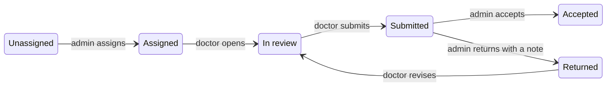
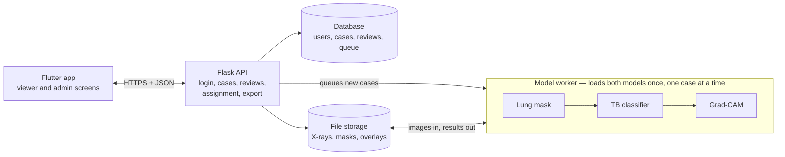

# LungCXR — Project Documentation & Backend Design

_As of 2026-10-03_

## Overview

LungCXR is a chest X-ray review tool for tuberculosis: a model gives a first TB / Normal reading, and doctors mark findings on the image, confirm or correct the model, and flag cases that need further testing. A hospital admin distributes the images among doctors and collects their completed reviews.

The project has three parts. Only the first two exist today, and they are not connected.

| Part | Technology | State today |
| --- | --- | --- |
| Viewer (frontend) | Flutter web, Forui UI kit, `provider` state | Single screen works with 2 hard-coded demo patients. Marks, lesion labels, image adjustments and chat live in memory only and are lost on reload. No login, no roles. |
| TB model | PyTorch ResNet18 on lung-masked images, Grad-CAM for explanations | Trained on the HPC cluster; checkpoint (`best_model.pth`, 134 MB) is in `server/pipline/`. Runs only as batch scripts over CSV files. |
| Backend | Flask (proposed in this document) | Not written. `server/` has a virtualenv with Flask installed and no application code. |

This document describes what exists, then proposes the backend that joins the two and adds the admin-to-doctor workflow. Nothing in the backend sections is built yet; they are a design for you to correct before code is written.

## Roles and workflow

The unit of work is a **case**: one chest X-ray of one patient, with the model's reading attached. An admin assigns cases to doctors; each doctor reviews their cases and submits them back; the admin accepts the review or returns it.

| Role | Can do | Cannot do |
| --- | --- | --- |
| Admin (hospital admin) | Upload X-rays and create cases. Create doctor accounts. Assign, reassign and bulk-assign cases. See every case and its status. Accept a submitted review or send it back with a note. Export reviews and model-error flags. | Edit a doctor's marks or verdict. The review stays the doctor's. |
| Doctor | See only cases assigned to them. View the image, model result and XAI overlay. Draw and label marks. Record a verdict, flag the model as wrong, flag for further testing. Submit the case. | See other doctors' cases. Change a case after submitting, unless the admin returns it. |



A case moves left to right. The only way back is the admin returning a submitted review, which reopens it for the same doctor. Reassigning to another doctor is allowed from Assigned, In review or Returned and sets the case back to Assigned.

Rules the backend enforces:

1. The model runs once when a case is created, before any doctor sees it. Its result is stored and never overwritten by a review.
2. A case has one assigned doctor at a time. Reassigning keeps the earlier doctor's draft in the history but hides it from the new doctor.
3. Submitting requires a verdict. Marks are optional, because a normal image has nothing to mark.
4. Every status change is written to an audit log with who, when and an optional note.

## What a doctor records

A review has four parts: the marks on the image, the doctor's own verdict, an optional flag that the model was wrong, and an optional request for further testing. The app flags suspected disease for follow-up; it does not issue a diagnosis.

| Part | What it holds | Required to submit |
| --- | --- | --- |
| Marks | Hand-drawn strokes on the image, each labelled with a finding. Already built in the viewer. | No |
| Verdict | The doctor's reading: TB suspected, No TB, Other disease suspected, or Image unreadable. Plus a free-text note. | Yes |
| Model feedback | Whether the doctor agrees with the model, and if not, why. | No (derived when verdict and model result differ) |
| Further testing | A flag, the tests requested, and an urgency. | No |

### Marks and disease tags

The viewer already offers 12 findings in 4 groups. The backend stores the finding as a short code so the list can grow without a schema change.

| Group | Findings |
| --- | --- |
| Parenchymal | Consolidation, Cavity, Nodule, Miliary pattern, Fibrosis, Calcification |
| Pleural | Pleural effusion, Pleural thickening, Pneumothorax |
| Mediastinal / hilar | Hilar lymphadenopathy, Mediastinal widening |
| Other | Other finding |

These are lesion types, not diseases. To tag a disease other than TB, the verdict "Other disease suspected" takes one or more disease tags. Proposed starting list: Pneumonia, Lung cancer suspected, COPD / emphysema, Heart failure / cardiomegaly, Silicosis, Old healed TB, Other (free text).

### Flagging that the model was wrong

The model outputs TB or Normal with a probability. A disagreement is recorded as one of:

- **False positive**: model said TB, doctor says no TB.
- **False negative**: model said Normal, doctor suspects TB. This is the error the current model makes; all 9 test-set errors were missed TB.
- **Wrong region**: the verdict is right but the XAI heatmap highlights the wrong area.
- **Cannot judge**: image quality too poor for the model's reading to mean anything.

Each flag keeps the model version, the probability shown and the doctor's marks. Together these form a labelled set for retraining, exportable by the admin.

### Flagging for further testing

The doctor ticks "Needs further testing", picks the tests and an urgency (Routine or Urgent). Proposed test list: Sputum GeneXpert, Sputum smear microscopy, Sputum culture, CT chest, Repeat X-ray, Other (free text). Flagged cases appear in their own filter for the admin.

## Frontend

The Flutter app is one screen, `Home`, built for web first. It is a working image viewer and marking tool with no network code: `pubspec.yaml` has no HTTP package, and `lib/constants/endpoints.dart` holds only the names `register` and `login`.

### What exists

| Area | Where | What it does |
| --- | --- | --- |
| Tool sidebar | `SidebarWid`, `AdjustmentPanel` | Pan, Mark, and brightness / contrast / hue / saturation sliders (-1 to 1, 0 = unchanged). The Segment item shows a "not connected" toast. |
| Canvas | `CanvasWid`, `XrayImage`, `PaintboardWid` | Zoom 0.5x to 8x, pan, image adjustments by colour matrix, freehand marks stored as image-relative points (0 to 1) so they survive zoom and resize. |
| Lesion labelling | `LesionLabelPanel`, `models/lesion.dart` | After a stroke, pick group then finding. Marks are coloured by group and can be relabelled, deleted or undone. |
| Header and footer | `CanvasHeader`, `CanvasFooter` | Patient name and client ID; result badge (always "Awaiting model"); XAI switch (shows a placeholder). |
| Patient list | `ClientBoard`, `PatientState` | Two hard-coded patients sharing one demo image. Each keeps its own marks, adjustments and chat while the app is open. |
| Chat | `ChatWid`, `ChatState` | Replies with a fixed "model isn't connected" message. |
| Tests | `test/` | 3 unit test files: patient state, editor state, colour matrix. |

### What must change

1. **Login and session.** A login screen, a stored token, and a role read from the token that decides which home screen opens.
2. **API layer.** Add an HTTP client package and a `lib/api/` layer. Fill `Endpoints` with the paths in the API section. `PatientState` loads the doctor's assigned cases instead of the constant list.
3. **Case replaces Patient.** The `Patient` model gains case ID, status, model result, probability and XAI overlay URL. `imageUrl` points at the backend.
4. **Saving marks.** `ImageEditorState` serialises marks (points plus finding code) to the backend as a draft. Autosave on change is suggested, since work is currently lost on reload.
5. **Review panel.** A new panel for verdict, disease tags, model feedback and further testing, with a Submit button. The footer bar is the natural place for its entry point.
6. **Real result and XAI.** The result badge shows the stored model result and probability. The XAI switch overlays the Grad-CAM image on the canvas.
7. **Admin screens.** A new `feature_admin` folder: case table with status filters, upload, assign to doctor, review a submission, export.
8. **Chat.** Out of scope for the first backend version. The TB model is a classifier and cannot answer questions; the panel needs a separate language model or should be hidden until then.

## Model pipeline

The classifier is a ResNet18 that reads a 512 x 512 chest X-ray with everything outside the lungs blacked out and returns a TB probability. It scored 0.990 accuracy on its 905-image test split, a figure that should not be trusted yet (see limits below).

### How one image is read

1. Load the image as greyscale and resize to 512 x 512.
2. Run the lung segmentation model to get a lung mask.
3. Multiply the image by the mask, so only lung pixels remain.
4. Copy to 3 channels and normalise with mean 0.5, standard deviation 0.5.
5. ResNet18 with a dropout + 2-output head. Output 1 is TB; the TB probability is the softmax of that output.
6. Grad-CAM on the last ResNet block produces the heatmap for the XAI overlay.

The backend must reproduce steps 1 to 4 exactly. A different resize or normalisation gives wrong answers without any error.

### Training and results

| Item | Value |
| --- | --- |
| Data | 3,000 Normal + 3,000 TB images, split 4,198 train / 897 validation / 905 test |
| Training | 100 epochs requested, batch 64, learning rate 1e-4; job hit its time limit at epoch 56 with the best model already saved |
| Test accuracy | 0.990 (896 of 905) |
| Errors | 9 missed TB cases, 0 false alarms |
| Files | `training/best_model.pth`, `inference/predictions.csv`, `evaluation/evaluation_results.json`, 905 Grad-CAM overlays |

### Known limits

- **The score may reflect the data source, not the disease.** Normal images come from public PNG collections; TB images come from a DICOM archive. A model can separate those by image style alone. A reported AUC of 1.0 is a warning sign. Doctors' "model was wrong" flags on real hospital images are the first honest test.
- **The segmentation model is not in the repository as code.** It is inside `segment_lung_cxr.zip` and `lung_segmentation_cxr.rar`. The backend needs it unpacked, along with its weights, before it can run the shipped classifier.
- **Two classes only.** The model says TB or Normal. It cannot name pneumonia or any other disease; those come from doctors' tags.
- **Not runnable locally as copied.** Every path in the CSV files points at the cluster filesystem.

## Backend design

One Flask application serves a JSON API to the Flutter app, stores cases and reviews in a SQL database, keeps image files on disk, and runs the model in a background worker so uploads do not wait on inference.



An upload returns at once with the prediction marked "queued". The worker picks the case up, writes the mask and overlay to storage and the result to the database, and the app shows it on the next refresh.

### Choices

| Concern | Choice | Reason |
| --- | --- | --- |
| Framework | Flask with blueprints, one per area (`auth`, `cases`, `reviews`, `admin`) | What you asked for; blueprints keep admin and doctor routes apart. |
| Database | SQLAlchemy + Flask-Migrate; SQLite for development, PostgreSQL for the hospital | Same code runs on a laptop and in deployment. |
| Login | Email + password, hashed with Werkzeug; JWT access token carrying user ID and role | Flutter web, mobile and desktop can all send a bearer token. |
| Image storage | Files on disk under `storage/`, named by case ID; the database holds only the path | X-rays are large; they do not belong in the database. |
| Model serving | A separate worker process loads the two models once and takes jobs from a queue table | Loading takes seconds and inference on CPU is slow. A web request should not block on it. |
| DICOM | Accept PNG, JPEG and DICOM; convert DICOM to PNG on upload and strip patient tags | The viewer shows PNG; the hospital will have DICOM. |

### Proposed layout

```
server/
  app/
    __init__.py        create_app(), config, extensions
    models.py          database tables
    auth/  cases/  reviews/  admin/     blueprints
    ml/
      preprocess.py    the one copy of load, resize, mask, normalise
      classifier.py    ResNet18 loader + predict
      segmenter.py     lung mask
      gradcam.py       heatmap overlay
    worker.py          takes queued cases, runs ml/, saves results
  migrations/
  storage/             images, masks, overlays (not in git)
  tests/
  pipline/             existing training code, unchanged
```

### Data model

| Table | Key fields | Notes |
| --- | --- | --- |
| `users` | id, email, password_hash, full_name, role (`admin` / `doctor`), active | Admin creates doctors; no self-registration. |
| `patients` | id, hospital_number, name, sex, birth_year | Minimal. One patient can have many cases. |
| `cases` | id, patient_id, image_path, status, assigned_to, assigned_by, assigned_at, due_at, created_at | Status follows the lifecycle above. |
| `predictions` | id, case_id, model_version, label, tb_probability, mask_path, overlay_path, state (`queued` / `done` / `failed`), created_at | Kept separate from `cases` so a new model version adds a row instead of overwriting. |
| `reviews` | id, case_id, doctor_id, verdict, note, state (`draft` / `submitted`), submitted_at | One per case per doctor. |
| `marks` | id, review_id, points (JSON list of x, y in 0 to 1), finding_code | Same shape the viewer already uses. |
| `disease_tags` | id, review_id, disease_code, free_text | Used with the "Other disease suspected" verdict. |
| `model_feedback` | id, review_id, prediction_id, kind (`false_positive` / `false_negative` / `wrong_region` / `cannot_judge`), note | Links to the exact prediction the doctor saw. |
| `test_requests` | id, review_id, test_code, urgency, free_text | Further testing. |
| `audit_log` | id, case_id, user_id, action, note, at | Every assignment and status change. |

## API reference

All paths sit under `/api/v1`, take and return JSON, and need `Authorization: Bearer <token>` except login. A doctor asking for a case that is not theirs gets 404, not 403, so case IDs cannot be probed.

### Everyone

| Method and path | Purpose |
| --- | --- |
| `POST /auth/login` | Email + password in; token, role and name out. |
| `GET /auth/me` | The signed-in user. |
| `GET /catalog` | Finding codes, disease tags, test list, verdict options. The app reads lists from here instead of hard-coding them. |

### Doctor

| Method and path | Purpose |
| --- | --- |
| `GET /cases?status=` | Cases assigned to me, with patient name, status and model result. |
| `GET /cases/{id}` | One case: patient, prediction, my review with marks. |
| `GET /cases/{id}/image` | The X-ray as PNG. |
| `GET /cases/{id}/overlay` | The Grad-CAM overlay as PNG. |
| `PUT /cases/{id}/review` | Save my draft: marks, verdict, note, disease tags, model feedback, test requests. Whole review replaced each time. |
| `POST /cases/{id}/review/submit` | Lock the review and move the case to Submitted. Fails with 422 if no verdict. |

### Admin

| Method and path | Purpose |
| --- | --- |
| `GET /admin/users`, `POST /admin/users`, `PATCH /admin/users/{id}` | List, create, deactivate doctors. |
| `POST /admin/cases` | Upload an image (multipart) with patient details. Creates the case and queues the model. |
| `GET /admin/cases?status=&doctor=&flag=` | All cases. `flag` filters by `model_wrong` or `needs_testing`. |
| `POST /admin/cases/assign` | `{case_ids: [...], doctor_id}`. Assign or reassign in bulk. |
| `GET /admin/cases/{id}` | Case with the submitted review and audit history. |
| `POST /admin/cases/{id}/accept` | Close the case. |
| `POST /admin/cases/{id}/return` | Send back to the doctor with a required note. |
| `GET /admin/export?kind=reviews` or `model_feedback` | CSV for reporting or retraining. |
| `GET /admin/stats` | Counts by status, per-doctor workload, model agreement rate. |

### Review payload

The body of `PUT /cases/{id}/review`. `points` are fractions of image width and height, exactly as the viewer stores them.

```json
{
  "verdict": "tb_suspected",
  "note": "Right upper zone cavity.",
  "marks": [
    {"finding": "cavity", "points": [[0.62, 0.21], [0.64, 0.23], [0.66, 0.22]]}
  ],
  "disease_tags": [],
  "model_feedback": {"kind": "false_negative", "note": "Model read this as normal."},
  "further_testing": {"tests": ["genexpert"], "urgency": "urgent"}
}
```

## Security and patient data

The system holds identifiable patient images and clinical opinions, so access is checked on the server for every request, and the app's hiding of buttons is never the only barrier.

- **Access by role and by assignment.** Admin routes reject doctor tokens. Doctor routes filter by `assigned_to` in the query itself.
- **Images are served through the API, not as public files.** `storage/` is never exposed as a static folder.
- **Passwords** are hashed; tokens expire (suggested 8 hours) and a deactivated user's token stops working.
- **DICOM tags** carrying name, birth date and IDs are stripped at upload. Patient details live only in the `patients` table.
- **Audit log** records who saw and changed each case.
- **Exports for retraining** leave out patient name and hospital number.
- **HTTPS** in deployment; the Flask development server is for development only.
- **Git.** `server/` is currently untracked and contains about 3.8 GB of archives, the model checkpoint, and CSV and Excel files with per-patient clinical metadata from the training data. It needs a `.gitignore` before anything in it is committed.

The model result must be worded as a screening aid. The result badge and any export should say "model reading", not "diagnosis".

## Build order and open questions

The workflow can be built and tested end to end before the model is wired in, so the model is step 4, not step 1.

1. **Backend skeleton.** App factory, database tables, migrations, login, seed script for one admin and two doctors, tests.
2. **Cases and assignment.** Upload, list, assign, the lifecycle and audit log. Predictions are stubbed as "queued".
3. **Reviews.** Draft save, submit, accept, return, flags, export.
4. **Model worker.** Unpack the segmentation code, move preprocessing into `app/ml/`, check its output against `inference/predictions.csv` on a few known images, then Grad-CAM.
5. **Frontend connection.** Login, API layer, case list, saving marks, review panel, real result and overlay.
6. **Admin screens** in Flutter.

### Decisions needed from you

- [ ] **One doctor per case, or several?** This design assigns one. If two doctors should read the same image independently and the admin compares them, `cases.assigned_to` becomes an assignments table.
- [ ] **Does the doctor see the model result before giving a verdict?** Showing it first is faster but biases the doctor, which weakens the "model was wrong" data. The alternative is to reveal it after the verdict is entered.
- [ ] **Who uploads images?** This design has only the admin upload. Should doctors add their own cases?
- [ ] **Verdict, disease and test lists.** The lists in this document are my proposal, not clinical guidance. A clinician should confirm them.
- [ ] **Where will it run?** A hospital machine without a GPU changes how long each image takes and whether the worker is needed on day one.
- [ ] **Is the segmentation model available?** I have not opened `segment_lung_cxr.zip`. If its weights are missing, the options are to retrieve them from the cluster or retrain the classifier in `raw` mode without masks.
- [ ] **Chat panel:** keep, hide, or connect to a language model later?
